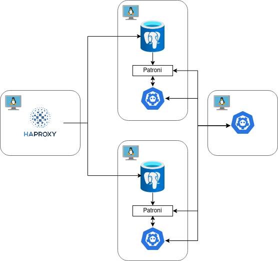

Форк [postgresql_cluster](https://github.com/vitabaks/postgresql_cluster), [настроенный](https://github.com/ScarletBlizzard/postgresql_cluster/commit/8eac8d8d9a7a811f32b04b9826b0b2670683dc69) под кластер из двух инстансов Postgres с etcd в качестве DCS (3 инстанса, 2 из них на машинах вместе с Postgres). Балансировщик нагрузки - HAProxy.

